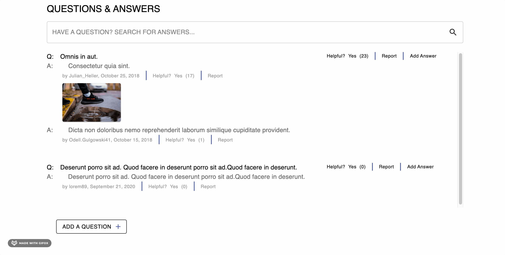

# Questions-and-Answers
> Question and Answers component for an Product Overview Page

## Key Features
- View, expand, and collapse question list

- View, expand, and collapse answer list

- Search for key words in the questions, answers, or username

- Lists sorted by most helpful with sellers answers on top
- Mark question and/or answer helpful
- Report question and/or answer to remove

- Add a question form modal with form validation
- Add a answer form modal with form validation

- Add a photo to answer in a tab component with preview

## Get Started
- npm install to install the dependencies
- open two tabs in terminal
- In one tab run "npm start"
- In the other tab run "npm run build"